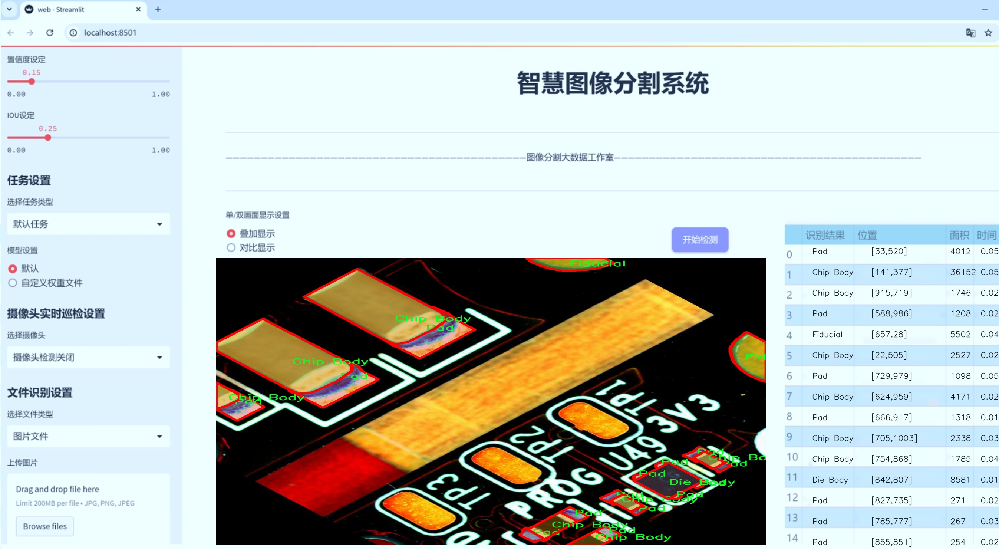
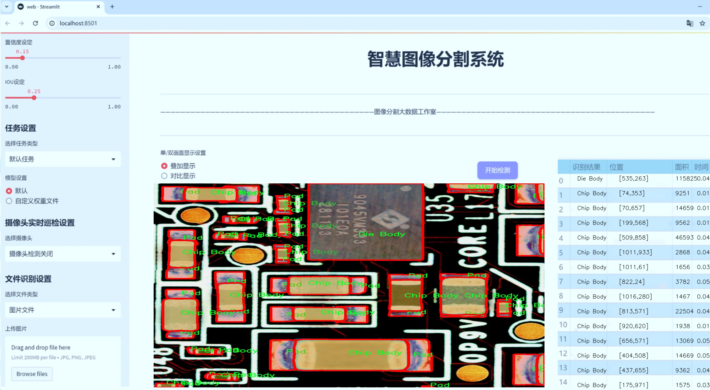
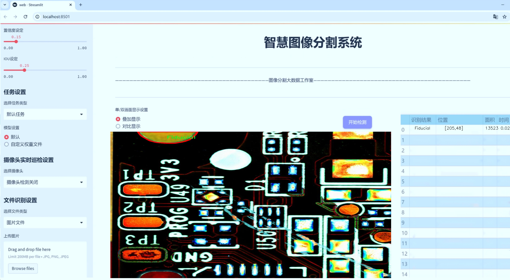
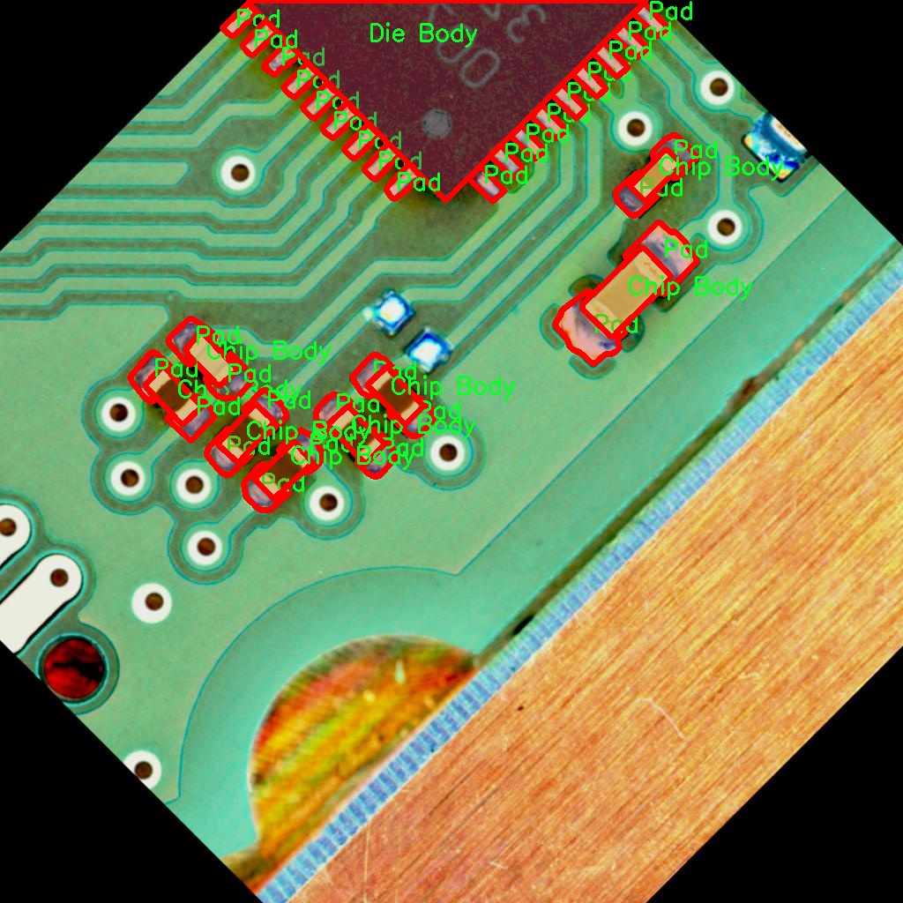
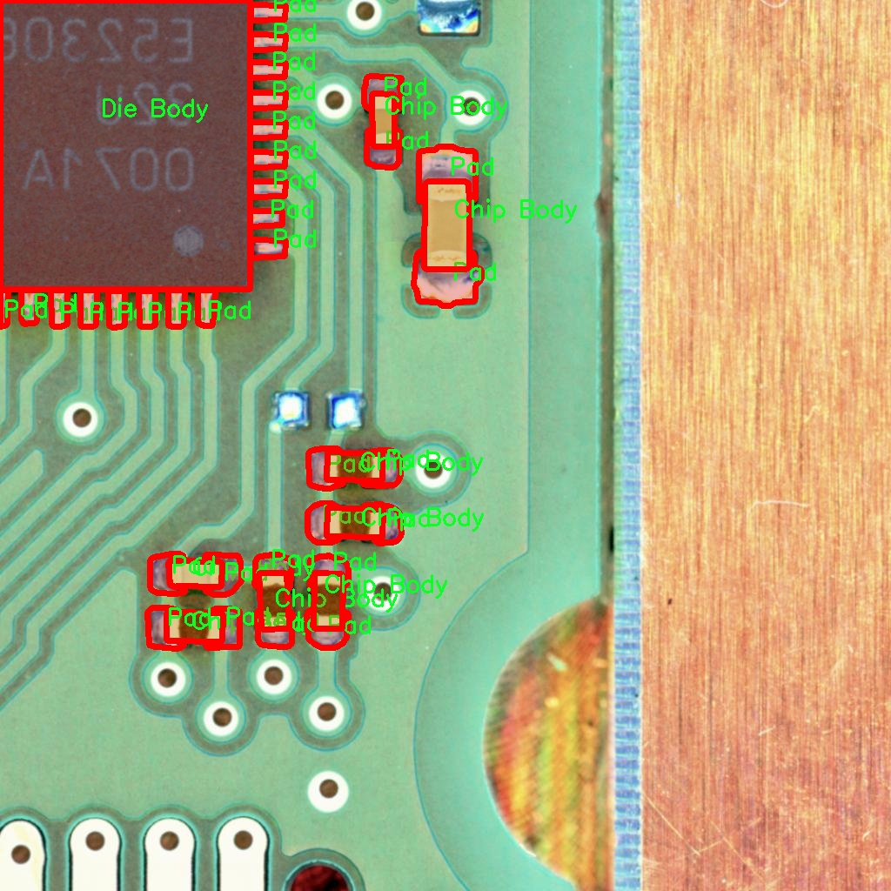
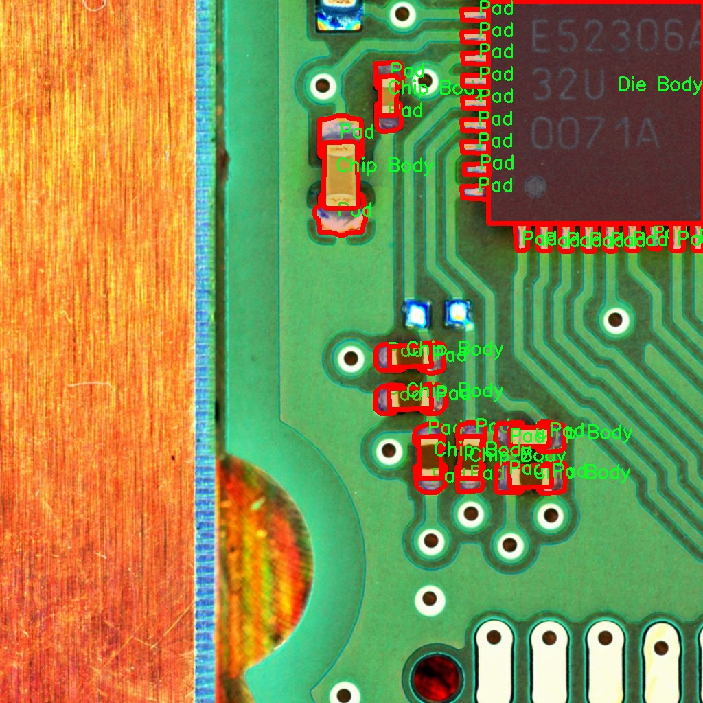
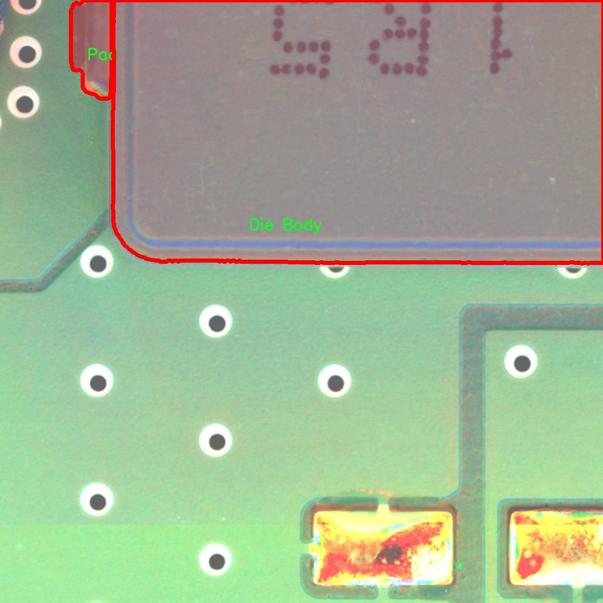
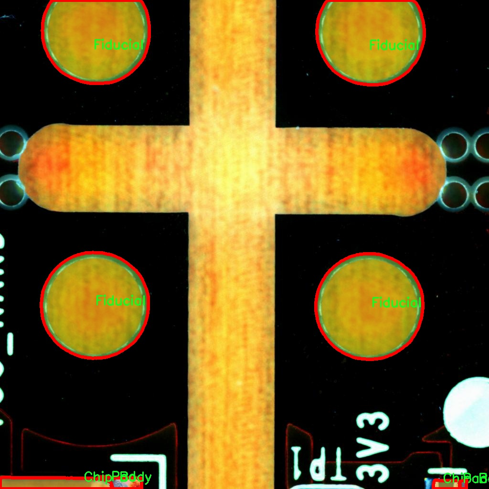

# 电路板电子元件图像分割系统源码＆数据集分享
 [yolov8-seg-efficientViT＆yolov8-seg-EfficientFormerV2等50+全套改进创新点发刊_一键训练教程_Web前端展示]

### 1.研究背景与意义

项目参考[ILSVRC ImageNet Large Scale Visual Recognition Challenge](https://gitee.com/YOLOv8_YOLOv11_Segmentation_Studio/projects)

项目来源[AAAI Global Al lnnovation Contest](https://kdocs.cn/l/cszuIiCKVNis)

研究背景与意义

随着电子技术的迅猛发展，电路板的复杂性和多样性不断增加，电子元件的种类和数量也随之激增。传统的电路板检测方法多依赖人工视觉和经验判断，效率低下且容易出现误判，难以满足现代工业生产对高精度、高效率的要求。因此，开发一种自动化的电路板电子元件图像分割系统显得尤为重要。图像分割技术在计算机视觉领域中扮演着关键角色，尤其是在物体检测和识别任务中，能够有效地将图像中的目标对象与背景分离，从而为后续的分析和处理提供基础。

近年来，YOLO（You Only Look Once）系列模型因其出色的实时性和准确性而受到广泛关注。YOLOv8作为该系列的最新版本，结合了深度学习的先进技术，具备了更高的检测精度和更快的处理速度。然而，针对电路板电子元件的图像分割任务，YOLOv8仍存在一定的局限性，尤其是在复杂背景和小目标检测方面。因此，基于改进YOLOv8的电路板电子元件图像分割系统的研究具有重要的学术价值和实际意义。

本研究将利用一个包含1400张图像的电路板电子元件数据集，涵盖了9个类别的电子元件，包括条形码、罐体、芯片体、芯片、ETC体、基准点、引脚、焊盘和引脚等。这些类别的多样性不仅反映了电路板设计的复杂性，也为模型的训练和测试提供了丰富的样本。通过对这些图像进行深入分析，我们可以更好地理解不同电子元件的特征及其在电路板中的位置关系，从而为模型的改进提供数据支持。

在实际应用中，电路板的检测和识别不仅关乎产品质量，还直接影响到生产效率和成本控制。通过实现高效的图像分割系统，能够大幅度提升电路板检测的自动化水平，减少人工干预，提高生产线的智能化程度。此外，改进后的YOLOv8模型在电路板电子元件图像分割中的应用，能够为其他领域的图像处理任务提供借鉴，推动计算机视觉技术的进一步发展。

综上所述，基于改进YOLOv8的电路板电子元件图像分割系统的研究，不仅具有重要的理论意义，还能为实际生产提供有效的技术支持。通过深入探讨电路板电子元件的图像分割技术，能够为未来的智能制造和工业自动化奠定坚实的基础，推动电子行业的技术进步和创新发展。

### 2.图片演示







##### 注意：由于此博客编辑较早，上面“2.图片演示”和“3.视频演示”展示的系统图片或者视频可能为老版本，新版本在老版本的基础上升级如下：（实际效果以升级的新版本为准）

  （1）适配了YOLOV8的“目标检测”模型和“实例分割”模型，通过加载相应的权重（.pt）文件即可自适应加载模型。

  （2）支持“图片识别”、“视频识别”、“摄像头实时识别”三种识别模式。

  （3）支持“图片识别”、“视频识别”、“摄像头实时识别”三种识别结果保存导出，解决手动导出（容易卡顿出现爆内存）存在的问题，识别完自动保存结果并导出到tempDir中。

  （4）支持Web前端系统中的标题、背景图等自定义修改，后面提供修改教程。

  另外本项目提供训练的数据集和训练教程,暂不提供权重文件（best.pt）,需要您按照教程进行训练后实现图片演示和Web前端界面演示的效果。

### 3.视频演示

[3.1 视频演示](https://www.bilibili.com/video/BV1bNyGYPEvr/)

### 4.数据集信息展示

##### 4.1 本项目数据集详细数据（类别数＆类别名）

nc: 9
names: ['Barcode-2D-', 'Can Body', 'Chip Body', 'Die Body', 'ETC Body', 'Fiducial', 'Lead', 'Pad', 'Pin']


##### 4.2 本项目数据集信息介绍

数据集信息展示

在本研究中，我们采用了名为“ibi”的数据集，以训练和改进YOLOv8-seg电路板电子元件图像分割系统。该数据集专注于电路板上不同类型的电子元件，具有九个类别，涵盖了电路板设计和制造中常见的关键组件。这些类别包括：Barcode-2D、Can Body、Chip Body、Die Body、ETC Body、Fiducial、Lead、Pad和Pin。每个类别在电路板的功能和结构中扮演着不可或缺的角色，理解和识别这些元件对于实现高效的电路板检测和故障诊断至关重要。

“ibi”数据集的设计旨在提供丰富的图像样本，以确保模型在训练过程中能够学习到不同元件的特征和变异性。数据集中包含了大量的电路板图像，这些图像在不同的光照条件、角度和背景下拍摄，旨在模拟实际应用中的复杂场景。通过这样的多样性，模型能够更好地适应现实世界中的各种情况，提高其在实际应用中的鲁棒性和准确性。

在类别方面，Barcode-2D代表了电路板上常见的二维条形码，通常用于产品追踪和信息存储。Can Body则指的是电路板上常见的电容器或电池的外壳，Chip Body则是指集成电路芯片的主体部分。Die Body则通常是指半导体器件的裸片部分，ETC Body则可能涉及到其他类型的封装体。Fiducial是用于图像识别和定位的标记，Lead和Pin则分别指代电子元件的引脚和连接点，而Pad则是电路板上用于焊接元件的金属垫片。

在图像分割任务中，准确识别和分割这些类别对于后续的电路板分析和处理至关重要。通过YOLOv8-seg模型的训练，我们希望能够实现对这些元件的高精度分割，进而提升电路板检测的效率和准确性。数据集中的每个类别都经过精心标注，确保在训练过程中，模型能够学习到每个元件的边界和特征。这种精确的标注不仅提高了模型的学习效果，也为后续的模型评估提供了可靠的基准。

此外，数据集的构建还考虑到了电路板设计的多样性和复杂性。不同的电路板设计可能会导致相同类别元件在形状、颜色和尺寸上的差异。因此，数据集中包含了多种不同类型的电路板图像，以帮助模型更全面地理解和识别这些元件。这种多样性不仅增强了模型的泛化能力，也为其在实际应用中的表现奠定了基础。

综上所述，“ibi”数据集为电路板电子元件图像分割系统的训练提供了丰富的样本和精确的标注，涵盖了九个关键类别。通过对这些数据的深入分析和学习，我们期望能够显著提升YOLOv8-seg模型在电路板图像分割任务中的性能，为电路板的检测和维护提供更为有效的技术支持。











### 5.全套项目环境部署视频教程（零基础手把手教学）

[5.1 环境部署教程链接（零基础手把手教学）](https://www.bilibili.com/video/BV1jG4Ve4E9t/?vd_source=bc9aec86d164b67a7004b996143742dc)


[5.2 安装Python虚拟环境创建和依赖库安装视频教程链接（零基础手把手教学）](https://www.bilibili.com/video/BV1nA4VeYEze/?vd_source=bc9aec86d164b67a7004b996143742dc)

### 6.手把手YOLOV8-seg训练视频教程（零基础小白有手就能学会）

[6.1 手把手YOLOV8-seg训练视频教程（零基础小白有手就能学会）](https://www.bilibili.com/video/BV1cA4VeYETe/?vd_source=bc9aec86d164b67a7004b996143742dc)


按照上面的训练视频教程链接加载项目提供的数据集，运行train.py即可开始训练



     Epoch   gpu_mem       box       obj       cls    labels  img_size
     1/200     0G   0.01576   0.01955  0.007536        22      1280: 100%|██████████| 849/849 [14:42<00:00,  1.04s/it]
               Class     Images     Labels          P          R     mAP@.5 mAP@.5:.95: 100%|██████████| 213/213 [01:14<00:00,  2.87it/s]
                 all       3395      17314      0.994      0.957      0.0957      0.0843

     Epoch   gpu_mem       box       obj       cls    labels  img_size
     2/200     0G   0.01578   0.01923  0.007006        22      1280: 100%|██████████| 849/849 [14:44<00:00,  1.04s/it]
               Class     Images     Labels          P          R     mAP@.5 mAP@.5:.95: 100%|██████████| 213/213 [01:12<00:00,  2.95it/s]
                 all       3395      17314      0.996      0.956      0.0957      0.0845

     Epoch   gpu_mem       box       obj       cls    labels  img_size
     3/200     0G   0.01561    0.0191  0.006895        27      1280: 100%|██████████| 849/849 [10:56<00:00,  1.29it/s]
               Class     Images     Labels          P          R     mAP@.5 mAP@.5:.95: 100%|███████   | 187/213 [00:52<00:00,  4.04it/s]
                 all       3395      17314      0.996      0.957      0.0957      0.0845


### 7.50+种全套YOLOV8-seg创新点代码加载调参视频教程（一键加载写好的改进模型的配置文件）

[7.1 50+种全套YOLOV8-seg创新点代码加载调参视频教程（一键加载写好的改进模型的配置文件）](https://www.bilibili.com/video/BV1Hw4VePEXv/?vd_source=bc9aec86d164b67a7004b996143742dc)

### 8.YOLOV8-seg图像分割算法原理

原始YOLOv8-seg算法原理

YOLOv8-seg算法是YOLO系列中的一项重要进展，旨在提升目标检测和分割任务的性能。该算法基于YOLOv5的架构进行了优化和升级，形成了一个轻量化的YOLOv8n模型，特别适合于实时应用场景。YOLOv8-seg的设计理念围绕着高效性和准确性展开，结合了多种创新技术，使其在复杂环境下的表现更为出色。

YOLOv8-seg的网络结构主要由三个部分组成：输入端、主干网络和检测头。输入端负责对输入图像进行预处理，包括Mosaic数据增强、自适应图像缩放和灰度填充等操作，以提高模型的鲁棒性和适应性。主干网络则是特征提取的核心部分，采用了轻量化的C2F模块替代了传统的C3模块。C2F模块通过将卷积核大小设置为3×3，深度调整为3、6、6、3，显著减少了计算量，同时保持了特征提取的有效性。这种设计不仅提高了特征提取的速度，还增强了模型对细粒度特征的捕捉能力。

在特征融合层，YOLOv8-seg采用了特征金字塔网络（FPN）和路径聚合网络（PAN）的结合，形成了一个高效的特征融合机制。通过引入BiFPN网络，YOLOv8-seg能够在不同尺度之间进行高效的特征连接和加权融合。这种双向跨尺度连接的设计，极大地提升了模型对多尺度特征的提取能力，使得在复杂背景下的小目标检测变得更加精准。

YOLOv8-seg的检测头采用了解耦合结构，将分类和回归任务分开处理，这一创新显著提高了模型的灵活性和准确性。与传统的锚框（Anchor-based）方法不同，YOLOv8-seg引入了无锚（Anchor-free）检测策略，这一策略不仅减少了计算复杂度，还提高了检测精度。通过这种方式，YOLOv8-seg能够更好地适应各种目标的形状和大小，尤其是在小目标检测方面表现优异。

在训练过程中，YOLOv8-seg采用了动态样本分配策略，结合了Task-Aligned Assigner方法，以优化正负样本的匹配。这一策略通过对分类分数和回归分数进行加权，使得模型在训练时能够更有效地学习到目标的特征。此外，YOLOv8-seg在损失计算方面也进行了创新，采用了二元交叉熵（BCELoss）作为分类损失，结合DFL（Distribution Focal Loss）和CIoU（Complete Intersection over Union）损失函数进行回归损失的计算。这种多重损失函数的设计，使得模型在训练过程中能够更好地平衡分类和回归任务，提高了整体性能。

YOLOv8-seg的轻量化设计使其在实时目标检测和分割任务中具有显著优势。相比于传统的目标检测算法，YOLOv8-seg在保持高精度的同时，能够以更快的速度处理图像，适用于各种实际应用场景，如自动驾驶、安防监控和智能机器人等。然而，在复杂的水面环境中，由于小目标漂浮物的特征复杂、背景多样，YOLOv8-seg仍然面临着定位误差和目标感知能力不足的问题。因此，针对这些挑战，后续的研究可能会集中在进一步优化模型结构和损失函数上，以提升其在特定场景下的表现。

总的来说，YOLOv8-seg算法通过一系列创新设计和优化策略，展现了在目标检测和分割领域的强大能力。其轻量化的网络结构、灵活的特征融合机制以及高效的训练策略，使得YOLOv8-seg成为当前目标检测技术中的一颗璀璨明珠。随着技术的不断进步，YOLOv8-seg有望在更多应用场景中发挥重要作用，为智能视觉系统的发展提供有力支持。


### 9.系统功能展示（检测对象为举例，实际内容以本项目数据集为准）

图9.1.系统支持检测结果表格显示

  图9.2.系统支持置信度和IOU阈值手动调节

  图9.3.系统支持自定义加载权重文件best.pt(需要你通过步骤5中训练获得)

  图9.4.系统支持摄像头实时识别

  图9.5.系统支持图片识别

  图9.6.系统支持视频识别

  图9.7.系统支持识别结果文件自动保存

  图9.8.系统支持Excel导出检测结果数据


### 10.50+种全套YOLOV8-seg创新点原理讲解（非科班也可以轻松写刊发刊，V11版本正在科研待更新）

#### 10.1 由于篇幅限制，每个创新点的具体原理讲解就不一一展开，具体见下列网址中的创新点对应子项目的技术原理博客网址【Blog】：


[10.1 50+种全套YOLOV8-seg创新点原理讲解链接](https://gitee.com/qunmasj/good)

#### 10.2 部分改进模块原理讲解(完整的改进原理见上图和技术博客链接)【如果此小节的图加载失败可以通过CSDN或者Github搜索该博客的标题访问原始博客，原始博客图片显示正常】

### YOLOv8简介
YoloV8模型结构
YOLOv3之前的所有YOLO对象检测模型都是用C语言编写的，并使用了Darknet框架，Ultralytics发布了第一个使用PyTorch框架实现的YOLO (YOLOv3)；YOLOv3之后，Ultralytics发布了YOLOv5，在2023年1月，Ultralytics发布了YOLOv8，包含五个模型，用于检测、分割和分类。 YOLOv8 Nano是其中最快和最小的，而YOLOv8 Extra Large (YOLOv8x)是其中最准确但最慢的，具体模型见后续的图。

YOLOv8附带以下预训练模型:

目标检测在图像分辨率为640的COCO检测数据集上进行训练。
实例分割在图像分辨率为640的COCO分割数据集上训练。
图像分类模型在ImageNet数据集上预训练，图像分辨率为224。
YOLOv8 概述
具体到 YOLOv8 算法，其核心特性和改动可以归结为如下：

提供了一个全新的SOTA模型（state-of-the-art model），包括 P5 640 和 P6 1280 分辨率的目标检测网络和基于YOLACT的实例分割模型。和 YOLOv5 一样，基于缩放系数也提供了 N/S/M/L/X 尺度的不同大小模型，用于满足不同场景需求
骨干网络和 Neck 部分可能参考了 YOLOv7 ELAN 设计思想，将 YOLOv5 的 C3 结构换成了梯度流更丰富的 C2f 结构，并对不同尺度模型调整了不同的通道数，属于对模型结构精心微调，不再是一套参数应用所有模型，大幅提升了模型性能。
Head 部分相比 YOLOv5 改动较大，换成了目前主流的解耦头结构，将分类和检测头分离，同时也从Anchor-Based 换成了 Anchor-Free
Loss 计算方面采用了TaskAlignedAssigner正样本分配策略，并引入了Distribution Focal Loss
训练的数据增强部分引入了 YOLOX 中的最后 10 epoch 关闭 Mosiac 增强的操作，可以有效地提升精度


### HRNet V2简介
现在设计高低分辨率融合的思路主要有以下四种：


（a）对称结构。如U-Net、Hourglass等，都是先下采样再上采样，上下采样过程对称。

（b）级联金字塔。如refinenet等，高低分辨率融合时经过卷积处理。

（c）简单的baseline，用转职卷积进行上采样。

（d）扩张卷积。如deeplab等，增大感受野，减少下采样次数，可以无需跳层连接直接进行上采样。

（b）（c）都是使用复杂一些的网络进行下采样（如resnet、vgg），再用轻量级的网络进行上采样。

HRNet V1是在（b）的基础上进行改进，从头到尾保持大的分辨率表示。然而HRNet V1仅是用在姿态估计领域的，HRNet V2对它做小小的改进可以使其适用于更广的视觉任务。这一改进仅仅增加了较小的计算开销，但却提升了较大的准确度。

#### 网络结构图：


这个结构图简洁明了就不多介绍了，首先图2的输入是已经经过下采样四倍的feature map，横向的conv block指的是basicblock 或 bottleblock，不同分辨率之间的多交叉线部分是multi-resolution convolution（多分辨率组卷积）。

到此为止HRNet V2和HRNet V1是完全一致的。

区别之处在于这个基网络上加的一个head：


图3介绍的是接在图2最后的head。（a）是HRNet V1的头，很明显他只用了大分辨率的特征图。（b）（c）是HRNet V2的创新点，（b）用与语义分割，（c）用于目标检测。除此之外作者还在实验部分介绍了用于分类的head，如图4所示。


#### 多分辨率block：


一个多分辨率block由多分辨率组卷积（a）和多分辨率卷积（b）组成。（c）是一个正常卷积的展开，（b）的灵感来源于（c）。代码中（a）部分由Bottleneck和BasicBlock组成。

多分辨率卷积和正常卷积的区别：（1）多分辨率卷积中，每个通道的subset的分辨率都不一样。（2）通道之间的连接如果是降分辨率，则用的是3x3的2stride的卷积，如果是升分辨率，用的是双线性最邻近插值上采样。


### 11.项目核心源码讲解（再也不用担心看不懂代码逻辑）

#### 11.1 ultralytics\solutions\ai_gym.py

以下是经过简化和注释的核心代码部分，保留了最重要的功能和逻辑：

```python
import cv2
from ultralytics.utils.plotting import Annotator

class AIGym:
    """管理实时视频流中基于姿势的健身步骤的类。"""

    def __init__(self):
        """初始化AIGym，设置默认的视觉和图像参数。"""
        self.im0 = None  # 当前帧图像
        self.tf = None   # 线条厚度
        self.keypoints = None  # 姿势关键点
        self.poseup_angle = None  # 上升姿势角度
        self.posedown_angle = None  # 下降姿势角度
        self.angle = None  # 当前角度
        self.count = None  # 动作计数
        self.stage = None  # 当前阶段
        self.pose_type = 'pushup'  # 姿势类型
        self.kpts_to_check = None  # 要检查的关键点

        self.view_img = False  # 是否显示图像
        self.annotator = None  # 注释器

    def set_args(self, kpts_to_check, line_thickness=2, view_img=False, pose_up_angle=145.0, pose_down_angle=90.0, pose_type='pullup'):
        """
        配置AIGym的参数。
        Args:
            kpts_to_check (list): 用于计数的3个关键点
            line_thickness (int): 边界框的线条厚度
            view_img (bool): 是否显示图像
            pose_up_angle (float): 上升姿势的角度
            pose_down_angle (float): 下降姿势的角度
            pose_type: "pushup", "pullup" 或 "abworkout"
        """
        self.kpts_to_check = kpts_to_check
        self.tf = line_thickness
        self.view_img = view_img
        self.poseup_angle = pose_up_angle
        self.posedown_angle = pose_down_angle
        self.pose_type = pose_type

    def start_counting(self, im0, results, frame_count):
        """
        计数健身步骤的函数。
        Args:
            im0 (ndarray): 当前视频流帧
            results: 姿势估计数据
            frame_count: 当前帧计数
        """
        self.im0 = im0  # 保存当前帧
        if frame_count == 1:
            # 初始化计数和角度
            self.count = [0] * len(results[0])
            self.angle = [0] * len(results[0])
            self.stage = ['-' for _ in results[0]]
        
        self.keypoints = results[0].keypoints.data  # 获取关键点数据
        self.annotator = Annotator(im0, line_width=2)  # 创建注释器

        for ind, k in enumerate(reversed(self.keypoints)):
            # 估计姿势角度
            self.angle[ind] = self.annotator.estimate_pose_angle(
                k[int(self.kpts_to_check[0])].cpu(),
                k[int(self.kpts_to_check[1])].cpu(),
                k[int(self.kpts_to_check[2])].cpu()
            )
            self.im0 = self.annotator.draw_specific_points(k, self.kpts_to_check, shape=(640, 640), radius=10)

            # 根据姿势类型更新计数和阶段
            if self.pose_type in ['pushup', 'pullup']:
                if self.angle[ind] > self.poseup_angle:
                    self.stage[ind] = 'up' if self.pose_type == 'pushup' else 'down'
                if self.angle[ind] < self.posedown_angle and self.stage[ind] == ('up' if self.pose_type == 'pushup' else 'down'):
                    self.stage[ind] = 'down' if self.pose_type == 'pushup' else 'up'
                    self.count[ind] += 1

            # 绘制角度、计数和阶段信息
            self.annotator.plot_angle_and_count_and_stage(
                angle_text=self.angle[ind],
                count_text=self.count[ind],
                stage_text=self.stage[ind],
                center_kpt=k[int(self.kpts_to_check[1])],
                line_thickness=self.tf
            )

            self.annotator.kpts(k, shape=(640, 640), radius=1, kpt_line=True)  # 绘制关键点

        # 显示图像
        if self.view_img:
            cv2.imshow('Ultralytics YOLOv8 AI GYM', self.im0)
            if cv2.waitKey(1) & 0xFF == ord('q'):
                return

if __name__ == '__main__':
    AIGym()  # 实例化AIGym类
```

### 代码分析：
1. **类的初始化**：`__init__` 方法中定义了多个属性，用于存储图像、关键点、角度、计数和阶段等信息。
2. **参数设置**：`set_args` 方法用于配置关键点、线条厚度、是否显示图像以及姿势的上下角度和类型。
3. **计数逻辑**：`start_counting` 方法中实现了根据姿势类型（如俯卧撑、引体向上等）来估计角度并更新计数和阶段的逻辑。
4. **图像显示**：如果设置了显示图像的参数，则使用 OpenCV 显示当前帧图像，并可以通过按 'q' 键退出。

这个简化的版本保留了核心功能，去掉了冗余的代码，并添加了详细的中文注释以便理解。

这个文件定义了一个名为 `AIGym` 的类，主要用于在实时视频流中基于人体姿态管理健身动作的计数。该类通过姿态估计技术来监测和记录用户的健身动作，例如俯卧撑、引体向上和腹部锻炼。

在 `__init__` 方法中，类初始化了一些默认值，包括图像参数、关键点信息、角度、计数和阶段等。具体来说，它定义了图像的初始状态、线条的厚度、关键点的坐标、动作的上下角度阈值，以及用于计数的状态和类型。

`set_args` 方法用于配置 `AIGym` 的参数，包括需要检查的关键点、线条厚度、是否显示图像、以及特定动作的上下角度和类型。这个方法允许用户根据不同的健身动作进行灵活的设置。

`start_counting` 方法是该类的核心功能，负责在每一帧图像中进行健身动作的计数。它接收当前帧图像、姿态估计结果和帧计数作为输入。方法首先检查帧计数，如果是第一帧，则初始化计数和角度的列表。接着，它提取关键点数据，并使用 `Annotator` 类来绘制关键点和估计角度。

在循环中，针对每个关键点，方法根据不同的健身动作类型（如俯卧撑、引体向上和腹部锻炼）来计算角度，并判断用户的动作是否符合预设的上下角度阈值。根据这些判断，更新动作的阶段（上或下）并进行计数。同时，使用 `Annotator` 绘制当前角度、计数和阶段信息在图像上。

最后，如果设置了 `view_img` 为 `True`，则会显示处理后的图像，并允许用户通过按下 'q' 键退出显示。

整体来看，这个类通过实时分析视频流中的人体姿态，能够帮助用户跟踪和记录他们的健身动作，提供了一种智能化的健身辅助工具。

#### 11.2 ui.py

以下是代码中最核心的部分，并附上详细的中文注释：

```python
import sys
import subprocess

def run_script(script_path):
    """
    使用当前 Python 环境运行指定的脚本。

    Args:
        script_path (str): 要运行的脚本路径

    Returns:
        None
    """
    # 获取当前 Python 解释器的路径
    python_path = sys.executable

    # 构建运行命令，使用 streamlit 运行指定的脚本
    command = f'"{python_path}" -m streamlit run "{script_path}"'

    # 执行命令，并等待其完成
    result = subprocess.run(command, shell=True)
    
    # 检查命令执行的返回码，如果不为0，表示出错
    if result.returncode != 0:
        print("脚本运行出错。")

# 实例化并运行应用
if __name__ == "__main__":
    # 指定要运行的脚本路径
    script_path = "web.py"  # 假设脚本在当前目录下

    # 调用函数运行指定的脚本
    run_script(script_path)
```

### 代码注释说明：
1. **导入模块**：
   - `sys`：用于访问与 Python 解释器紧密相关的变量和函数。
   - `subprocess`：用于创建新进程、连接到它们的输入/输出/错误管道，并获得它们的返回码。

2. **`run_script` 函数**：
   - 接受一个参数 `script_path`，表示要运行的 Python 脚本的路径。
   - 使用 `sys.executable` 获取当前 Python 解释器的路径，以确保使用相同的环境运行脚本。
   - 构建命令字符串，使用 `streamlit` 模块运行指定的脚本。
   - 使用 `subprocess.run` 执行构建的命令，并等待其完成。
   - 检查返回码，如果返回码不为0，表示脚本运行出错，并打印错误信息。

3. **主程序部分**：
   - 通过 `if __name__ == "__main__":` 确保只有在直接运行该脚本时才会执行以下代码。
   - 指定要运行的脚本路径为 `web.py`。
   - 调用 `run_script` 函数，传入脚本路径以执行该脚本。

这个程序文件名为 `ui.py`，主要功能是通过当前的 Python 环境来运行一个指定的脚本。程序首先导入了必要的模块，包括 `sys`、`os` 和 `subprocess`，以及一个自定义的路径处理模块 `abs_path`。

在 `run_script` 函数中，程序接收一个参数 `script_path`，这是要运行的脚本的路径。函数首先获取当前 Python 解释器的路径，这通过 `sys.executable` 实现。接着，程序构建一个命令字符串，使用 `streamlit` 模块来运行指定的脚本。命令的格式是将 Python 解释器的路径与 `-m streamlit run` 结合起来，再加上脚本的路径。

随后，程序使用 `subprocess.run` 方法来执行这个命令。`shell=True` 参数允许在 shell 中执行命令。如果脚本运行出现错误，程序会检查返回码 `result.returncode`，如果不为零，则打印出“脚本运行出错”的提示信息。

在文件的最后部分，程序通过 `if __name__ == "__main__":` 语句来确保只有在直接运行该文件时才会执行后面的代码。在这里，程序指定了要运行的脚本路径为 `web.py`，并调用 `run_script` 函数来执行这个脚本。

总体来说，这个程序的目的是为用户提供一个简单的接口，以便在当前的 Python 环境中运行特定的脚本，特别是与 `streamlit` 相关的应用。

#### 11.3 ultralytics\nn\modules\conv.py


这个程序文件是Ultralytics YOLO（You Only Look Once）项目的一部分，主要实现了一些卷积模块。这些模块在深度学习中广泛用于图像处理和计算机视觉任务，尤其是在目标检测和图像分类中。以下是对代码的详细说明。

首先，文件导入了必要的库，包括数学库、NumPy和PyTorch。PyTorch是一个流行的深度学习框架，提供了构建和训练神经网络的工具。

接下来，定义了一个辅助函数`autopad`，用于根据卷积核的大小、填充和扩张因子自动计算填充的大小，以确保输出的形状与输入相同。

然后，定义了多个卷积类。`Conv`类是一个标准的卷积层，包含卷积操作、批归一化和激活函数。构造函数接受多个参数，如输入通道数、输出通道数、卷积核大小、步幅、填充、分组、扩张和激活函数。`forward`方法定义了前向传播过程，即对输入张量应用卷积、批归一化和激活函数。

`Conv2`类是一个简化的卷积模块，具有额外的1x1卷积，用于提高模型的表达能力。它重写了`forward`方法，以实现并行卷积的融合。

`LightConv`类实现了一种轻量级卷积，结合了标准卷积和深度卷积（`DWConv`）。深度卷积是指在每个输入通道上单独进行卷积操作，通常用于减少参数数量和计算量。

`DWConv`类是深度卷积的实现，`DWConvTranspose2d`则是深度转置卷积的实现，适用于上采样操作。

`ConvTranspose`类实现了转置卷积层，通常用于生成模型中，如生成对抗网络（GAN）。

`Focus`类用于将空间信息聚焦到通道空间，通过对输入张量进行重组和卷积操作来实现。

`GhostConv`类实现了一种名为Ghost卷积的模块，它通过创建更多的特征图来提高模型的表现，同时保持计算效率。

`RepConv`类实现了一种重复卷积模块，支持训练和推理状态的切换。它通过融合卷积和批归一化来优化模型的推理速度。

接下来，定义了注意力机制模块，包括`ChannelAttention`和`SpatialAttention`，它们分别用于在通道和空间维度上重新校准特征图。`CBAM`类结合了这两种注意力机制，以增强特征表示。

最后，`Concat`类用于在指定维度上连接多个张量，通常用于将不同层的特征图合并。

整体来看，这个文件实现了多种卷积和注意力机制模块，旨在为YOLO模型提供灵活的构建块，以提高其在目标检测任务中的性能和效率。

#### 11.3 ultralytics\utils\plotting.py

以下是经过简化和注释的核心代码部分，主要保留了 `Colors` 和 `Annotator` 类的实现，以及 `plot_images` 函数。其他功能的实现被省略，以突出核心功能。

```python
import numpy as np
import cv2
from PIL import Image, ImageDraw, ImageFont

class Colors:
    """
    颜色类，用于处理颜色调色板。
    """

    def __init__(self):
        """初始化颜色调色板，使用十六进制颜色值转换为RGB格式。"""
        hexs = ('FF3838', 'FF9D97', 'FF701F', 'FFB21D', 'CFD231', '48F90A', '92CC17', '3DDB86', 
                '1A9334', '00D4BB', '2C99A8', '00C2FF', '344593', '6473FF', '0018EC', 
                '8438FF', '520085', 'CB38FF', 'FF95C8', 'FF37C7')
        self.palette = [self.hex2rgb(f'#{c}') for c in hexs]  # 将十六进制颜色转换为RGB
        self.n = len(self.palette)  # 颜色数量

    @staticmethod
    def hex2rgb(h):
        """将十六进制颜色代码转换为RGB值。"""
        return tuple(int(h[1 + i:1 + i + 2], 16) for i in (0, 2, 4))


class Annotator:
    """
    注释类，用于在图像上绘制框、文本和关键点。
    """

    def __init__(self, im, line_width=None, font='Arial.ttf', pil=False):
        """初始化Annotator类，设置图像和绘制参数。"""
        self.im = im if isinstance(im, Image.Image) else Image.fromarray(im)  # 将输入转换为PIL图像
        self.draw = ImageDraw.Draw(self.im)  # 创建绘图对象
        self.lw = line_width or 2  # 设置线宽

        # 加载字体
        try:
            self.font = ImageFont.truetype(font, 20)  # 使用指定字体和大小
        except Exception:
            self.font = ImageFont.load_default()  # 加载默认字体

    def box_label(self, box, label='', color=(128, 128, 128), txt_color=(255, 255, 255)):
        """在图像上添加一个带标签的矩形框。"""
        self.draw.rectangle(box, outline=color, width=self.lw)  # 绘制矩形框
        if label:
            w, h = self.font.getsize(label)  # 获取文本的宽度和高度
            self.draw.rectangle((box[0], box[1] - h, box[0] + w, box[1]), fill=color)  # 绘制标签背景
            self.draw.text((box[0], box[1] - h), label, fill=txt_color, font=self.font)  # 绘制标签文本

    def result(self):
        """返回注释后的图像。"""
        return np.asarray(self.im)  # 将PIL图像转换为numpy数组


def plot_images(images, fname='images.jpg'):
    """绘制图像网格并保存。"""
    # 假设images是一个numpy数组，形状为 (batch_size, height, width, channels)
    batch_size, h, w, _ = images.shape
    mosaic = np.full((h * batch_size, w, 3), 255, dtype=np.uint8)  # 创建白色背景的马赛克图像

    for i in range(batch_size):
        mosaic[i * h:(i + 1) * h, :] = images[i]  # 将每张图像放入马赛克中

    annotator = Annotator(mosaic)  # 创建Annotator实例
    annotator.result()  # 获取结果图像并保存
    cv2.imwrite(fname, mosaic)  # 使用OpenCV保存图像
```

### 代码说明：
1. **Colors 类**：用于管理颜色调色板，提供将十六进制颜色转换为RGB的功能。
2. **Annotator 类**：用于在图像上绘制矩形框和文本。支持使用PIL库进行绘图。
   - `box_label` 方法：在图像上绘制矩形框并添加标签。
   - `result` 方法：返回处理后的图像。
3. **plot_images 函数**：将多张图像拼接成一个网格并保存为文件。使用 `Annotator` 类进行注释处理。

这样处理后，代码的核心功能得以保留，并且每个部分都有详细的中文注释，便于理解。

这个程序文件 `ultralytics/utils/plotting.py` 是 Ultralytics YOLO 项目的一部分，主要用于图像的可视化和标注。它包含多个类和函数，提供了绘制图像、标注框、关键点、掩膜等功能。以下是对文件中主要内容的说明。

首先，文件导入了一些必要的库，包括 `cv2`、`matplotlib`、`numpy`、`torch` 和 `PIL`，这些库提供了图像处理和绘图的基础功能。接着，定义了一个 `Colors` 类，用于管理颜色调色板，支持将十六进制颜色代码转换为 RGB 值。该类初始化时定义了一组颜色，并提供了调用方法以便根据索引获取颜色。

接下来，定义了 `Annotator` 类，负责在图像上绘制各种标注，包括边框、文本、关键点和掩膜。该类的构造函数接受图像、线宽、字体等参数，并根据是否使用 PIL 或 OpenCV 来初始化绘图工具。`Annotator` 类还定义了多个方法，如 `box_label` 用于绘制边框和标签，`masks` 用于绘制掩膜，`kpts` 用于绘制关键点，`rectangle` 和 `text` 用于绘制矩形和文本。

文件中还定义了一些用于绘制和保存图像的函数。例如，`plot_labels` 函数用于绘制训练标签的直方图和统计信息，`save_one_box` 函数用于根据给定的边框从图像中裁剪并保存部分图像，`plot_images` 函数用于绘制图像网格并添加标签。

此外，`plot_results` 函数用于从 CSV 文件中绘制训练结果，支持不同类型的数据（如分割、姿态估计和分类）。`plt_color_scatter` 函数用于根据 2D 直方图绘制散点图，`plot_tune_results` 函数用于绘制超参数调优结果。

最后，文件还包含一些用于输出和可视化特征图的函数，如 `output_to_target` 和 `feature_visualization`，这些函数用于将模型输出转换为可用于绘图的格式，并可视化模型在推理过程中的特征图。

整体而言，这个文件提供了丰富的功能，方便用户在使用 YOLO 模型进行目标检测时对结果进行可视化和分析。

#### 11.4 ultralytics\nn\extra_modules\orepa.py

以下是代码中最核心的部分，并附上详细的中文注释：

```python
import torch
import torch.nn as nn
import torch.nn.functional as F
import numpy as np

# 定义OREPA模块
class OREPA(nn.Module):
    def __init__(self, in_channels, out_channels, kernel_size=3, stride=1, padding=None, groups=1, dilation=1, act=True):
        super(OREPA, self).__init__()
        
        # 激活函数的选择
        self.nonlinear = nn.ReLU() if act else nn.Identity()
        
        # 保存输入和输出通道数
        self.in_channels = in_channels
        self.out_channels = out_channels
        self.groups = groups
        
        # 初始化卷积层的参数
        self.weight_orepa_origin = nn.Parameter(torch.Tensor(out_channels, in_channels // groups, kernel_size, kernel_size))
        nn.init.kaiming_uniform_(self.weight_orepa_origin, a=0.0)  # Kaiming初始化
        
        # 其他卷积层的参数
        self.weight_orepa_avg_conv = nn.Parameter(torch.Tensor(out_channels, in_channels // groups, 1, 1))
        nn.init.kaiming_uniform_(self.weight_orepa_avg_conv, a=0.0)
        
        self.weight_orepa_1x1 = nn.Parameter(torch.Tensor(out_channels, in_channels // groups, 1, 1))
        nn.init.kaiming_uniform_(self.weight_orepa_1x1, a=0.0)

        # 初始化向量，用于加权不同分支的输出
        self.vector = nn.Parameter(torch.Tensor(3, out_channels))
        nn.init.constant_(self.vector[0, :], 1.0)  # origin
        nn.init.constant_(self.vector[1, :], 0.0)  # avg
        nn.init.constant_(self.vector[2, :], 0.0)  # 1x1

    def weight_gen(self):
        # 生成最终的卷积权重
        weight_orepa_origin = self.weight_orepa_origin * self.vector[0, :].view(-1, 1, 1, 1)
        weight_orepa_avg = self.weight_orepa_avg_conv * self.vector[1, :].view(-1, 1, 1, 1)
        weight_orepa_1x1 = self.weight_orepa_1x1 * self.vector[2, :].view(-1, 1, 1, 1)

        # 将所有权重相加，得到最终的卷积权重
        weight = weight_orepa_origin + weight_orepa_avg + weight_orepa_1x1
        return weight

    def forward(self, inputs):
        # 生成权重并进行卷积操作
        weight = self.weight_gen()
        out = F.conv2d(inputs, weight, stride=1, padding=1, groups=self.groups)
        return self.nonlinear(out)  # 应用激活函数

# 定义RepVGGBlock_OREPA模块
class RepVGGBlock_OREPA(nn.Module):
    def __init__(self, in_channels, out_channels, kernel_size=3, stride=1, padding=None, groups=1, act=True):
        super(RepVGGBlock_OREPA, self).__init__()
        
        # 保存输入和输出通道数
        self.in_channels = in_channels
        self.out_channels = out_channels
        self.groups = groups
        
        # 初始化OREPA模块
        self.rbr_dense = OREPA(in_channels, out_channels, kernel_size=kernel_size, stride=stride, groups=groups)
        self.rbr_1x1 = nn.Conv2d(in_channels, out_channels, kernel_size=1, stride=stride, groups=groups, bias=False)

    def forward(self, inputs):
        # 计算不同分支的输出
        out1 = self.rbr_dense(inputs)  # OREPA模块的输出
        out2 = self.rbr_1x1(inputs)    # 1x1卷积的输出
        
        # 将所有输出相加
        out = out1 + out2
        return out  # 返回最终输出
```

### 代码说明：
1. **OREPA类**：
   - 该类实现了一个自定义的卷积模块，使用多个分支来生成最终的卷积权重。
   - `weight_gen`方法用于生成最终的卷积权重，它结合了不同分支的权重和对应的权重系数。
   - `forward`方法执行卷积操作并应用激活函数。

2. **RepVGGBlock_OREPA类**：
   - 该类实现了一个块结构，包含一个OREPA模块和一个1x1卷积层。
   - `forward`方法计算两个分支的输出并将它们相加，形成最终的输出。

这些核心部分构成了一个高效的卷积神经网络模块，适用于各种计算机视觉任务。

这个程序文件 `orepa.py` 定义了一些深度学习中的卷积模块，主要是基于 PyTorch 框架。文件中包含多个类和函数，主要用于实现一种名为 OREPA（Optimized Reparameterization for Efficient Convolution）的卷积结构。以下是对代码的详细说明。

首先，文件导入了必要的库，包括 PyTorch 和 NumPy。接着，定义了一些辅助函数，如 `transI_fusebn` 和 `transVI_multiscale`，用于处理卷积核和批归一化的融合，以及对卷积核进行多尺度填充。

`OREPA` 类是该文件的核心类，继承自 `nn.Module`。它的构造函数接受多个参数，包括输入和输出通道数、卷积核大小、步幅、填充、分组卷积等。根据 `deploy` 参数的不同，该类可以在训练模式和推理模式下工作。在训练模式下，使用多个参数来生成卷积权重，并进行初始化；而在推理模式下，直接使用一个标准的卷积层。

在 `OREPA` 类中，定义了多个卷积权重参数，包括原始卷积权重、平均卷积权重、先验卷积权重等。通过 `weight_gen` 方法生成最终的卷积权重，结合了不同的权重和向量。

`OREPA_LargeConv` 类是一个扩展的卷积模块，支持更大的卷积核。它的结构与 `OREPA` 类类似，但设计上更为复杂，支持多层卷积。

`ConvBN` 类是一个简单的卷积加批归一化模块。它可以在训练和推理模式下工作，具有相应的权重融合功能。

`OREPA_3x3_RepVGG` 类是一个特定的 OREPA 模块，专门用于处理 3x3 卷积。它包含了多个分支的卷积操作，并通过向量加权组合这些分支的输出。

最后，`RepVGGBlock_OREPA` 类实现了一个完整的块结构，结合了 OREPA 模块和 1x1 卷积。它支持可选的 Squeeze-and-Excitation（SE）注意力机制，能够在推理和训练模式下灵活切换。

整体来看，这个文件实现了一种高效的卷积结构，旨在通过重参数化技术优化卷积操作的性能，适用于深度学习模型的构建和训练。

#### 11.5 train.py

以下是经过简化和注释的核心代码部分：

```python
import os
import torch
import yaml
from ultralytics import YOLO  # 导入YOLO模型

if __name__ == '__main__':  # 确保该模块被直接运行时才执行以下代码
    # 设置训练参数
    workers = 1  # 数据加载的工作进程数
    batch = 8  # 每个批次的样本数量
    device = "0" if torch.cuda.is_available() else "cpu"  # 选择使用GPU还是CPU

    # 获取数据集配置文件的绝对路径
    data_path = abs_path(f'datasets/data/data.yaml', path_type='current')

    # 读取YAML文件，保持原有顺序
    with open(data_path, 'r') as file:
        data = yaml.load(file, Loader=yaml.FullLoader)

    # 修改数据集路径
    if 'train' in data and 'val' in data and 'test' in data:
        directory_path = os.path.dirname(data_path.replace(os.sep, '/'))  # 获取目录路径
        data['train'] = directory_path + '/train'  # 更新训练集路径
        data['val'] = directory_path + '/val'      # 更新验证集路径
        data['test'] = directory_path + '/test'    # 更新测试集路径

        # 将修改后的数据写回YAML文件
        with open(data_path, 'w') as file:
            yaml.safe_dump(data, file, sort_keys=False)

    # 加载YOLO模型配置和预训练权重
    model = YOLO(r"C:\codeseg\codenew\50+种YOLOv8算法改进源码大全和调试加载训练教程（非必要）\改进YOLOv8模型配置文件\yolov8-seg-C2f-Faster.yaml").load("./weights/yolov8s-seg.pt")

    # 开始训练模型
    results = model.train(
        data=data_path,  # 指定训练数据的配置文件路径
        device=device,  # 使用选择的设备进行训练
        workers=workers,  # 数据加载的工作进程数
        imgsz=640,  # 输入图像的大小
        epochs=100,  # 训练的轮数
        batch=batch,  # 每个批次的样本数量
    )
```

### 代码注释说明：
1. **导入库**：导入必要的库，包括操作系统、PyTorch、YAML解析库和YOLO模型。
2. **主程序入口**：`if __name__ == '__main__':` 确保代码仅在直接运行时执行。
3. **设置训练参数**：
   - `workers`：设置数据加载的工作进程数。
   - `batch`：设置每个批次的样本数量。
   - `device`：检查是否有可用的GPU，如果有则使用GPU，否则使用CPU。
4. **数据集路径处理**：
   - 获取数据集配置文件的绝对路径。
   - 读取YAML文件并保持原有顺序。
   - 更新训练、验证和测试集的路径，并将修改后的数据写回YAML文件。
5. **加载YOLO模型**：根据指定的配置文件和预训练权重加载YOLO模型。
6. **开始训练模型**：调用`model.train()`方法进行模型训练，传入数据路径、设备、工作进程数、图像大小、训练轮数和批次大小等参数。

这个程序文件`train.py`的主要功能是使用YOLO（You Only Look Once）模型进行目标检测的训练。程序首先导入了一些必要的库，包括操作系统库`os`、深度学习框架`torch`、YAML解析库`yaml`以及YOLO模型库`ultralytics`。此外，还导入了`matplotlib`库用于图形显示，但在这里主要是为了设置后端为'TkAgg'。

在程序的主执行部分，首先设置了一些训练参数，包括工作进程数`workers`、批次大小`batch`和设备类型`device`。设备类型会根据是否有可用的GPU来选择，如果有GPU则使用GPU（标记为"0"），否则使用CPU。

接下来，程序通过`abs_path`函数获取数据集配置文件的绝对路径，该配置文件是一个YAML格式的文件，包含了训练、验证和测试数据的路径。程序将该路径转换为Unix风格的路径，并提取出目录路径。

程序打开YAML文件并读取内容，使用`yaml.load`函数保持原有顺序。然后，程序检查YAML文件中是否包含'train'、'val'和'test'字段，如果存在，则将这些字段的值修改为相应的训练、验证和测试数据的绝对路径。修改完成后，程序将更新后的数据写回到YAML文件中。

在模型加载部分，程序通过指定的配置文件路径加载YOLO模型，并使用预训练的权重文件`yolov8s-seg.pt`。这里的模型配置文件可以根据需要进行调整，以适应不同的模型结构和要求。

最后，程序调用`model.train`方法开始训练模型，传入训练数据的配置文件路径、设备类型、工作进程数、输入图像大小（640x640）、训练的轮数（100个epoch）以及批次大小。通过这些参数，模型将进行训练，优化其在目标检测任务上的性能。

#### 11.6 ultralytics\utils\callbacks\neptune.py

以下是代码中最核心的部分，并附上详细的中文注释：

```python
# 导入必要的库
from ultralytics.utils import LOGGER, SETTINGS, TESTS_RUNNING

# 尝试导入NeptuneAI库并进行初始化
try:
    assert not TESTS_RUNNING  # 确保不是在测试环境中
    assert SETTINGS['neptune'] is True  # 确保Neptune集成已启用
    import neptune
    from neptune.types import File

    assert hasattr(neptune, '__version__')  # 确保Neptune库的版本存在

    run = None  # 初始化NeptuneAI实验记录实例

except (ImportError, AssertionError):
    neptune = None  # 如果导入失败或断言失败，则将neptune设置为None


def _log_scalars(scalars, step=0):
    """将标量数据记录到NeptuneAI实验记录器中。"""
    if run:  # 如果Neptune运行实例存在
        for k, v in scalars.items():  # 遍历标量字典
            run[k].append(value=v, step=step)  # 记录每个标量值


def _log_images(imgs_dict, group=''):
    """将图像记录到NeptuneAI实验记录器中。"""
    if run:  # 如果Neptune运行实例存在
        for k, v in imgs_dict.items():  # 遍历图像字典
            run[f'{group}/{k}'].upload(File(v))  # 上传每个图像文件


def on_pretrain_routine_start(trainer):
    """在训练例程开始之前调用的回调函数。"""
    try:
        global run
        # 初始化Neptune运行实例
        run = neptune.init_run(project=trainer.args.project or 'YOLOv8', name=trainer.args.name, tags=['YOLOv8'])
        # 记录超参数配置
        run['Configuration/Hyperparameters'] = {k: '' if v is None else v for k, v in vars(trainer.args).items()}
    except Exception as e:
        LOGGER.warning(f'WARNING ⚠️ NeptuneAI安装但未正确初始化，未记录此运行。 {e}')


def on_train_epoch_end(trainer):
    """每个训练周期结束时调用的回调函数。"""
    _log_scalars(trainer.label_loss_items(trainer.tloss, prefix='train'), trainer.epoch + 1)  # 记录训练损失
    _log_scalars(trainer.lr, trainer.epoch + 1)  # 记录学习率
    if trainer.epoch == 1:  # 如果是第一个周期
        # 记录训练批次的图像
        _log_images({f.stem: str(f) for f in trainer.save_dir.glob('train_batch*.jpg')}, 'Mosaic')


def on_val_end(validator):
    """每次验证结束时调用的回调函数。"""
    if run:
        # 记录验证图像
        _log_images({f.stem: str(f) for f in validator.save_dir.glob('val*.jpg')}, 'Validation')


def on_train_end(trainer):
    """训练结束时调用的回调函数。"""
    if run:
        # 记录最终结果和图像
        files = [
            'results.png', 'confusion_matrix.png', 'confusion_matrix_normalized.png',
            *(f'{x}_curve.png' for x in ('F1', 'PR', 'P', 'R'))]
        files = [(trainer.save_dir / f) for f in files if (trainer.save_dir / f).exists()]  # 过滤存在的文件
        for f in files:
            _log_plot(title=f.stem, plot_path=f)  # 记录每个图像
        # 记录最终模型
        run[f'weights/{trainer.args.name or trainer.args.task}/{str(trainer.best.name)}'].upload(File(str(trainer.best)))


# 定义回调函数字典，如果neptune存在则包含相关回调
callbacks = {
    'on_pretrain_routine_start': on_pretrain_routine_start,
    'on_train_epoch_end': on_train_epoch_end,
    'on_fit_epoch_end': on_fit_epoch_end,
    'on_val_end': on_val_end,
    'on_train_end': on_train_end} if neptune else {}
```

### 代码说明：
1. **NeptuneAI初始化**：代码首先尝试导入NeptuneAI库，并确保其正确初始化，以便记录实验数据。
2. **日志记录函数**：定义了几个函数来记录标量数据、图像和图表，确保在训练和验证过程中能够有效地记录相关信息。
3. **回调函数**：定义了多个回调函数，这些函数在训练的不同阶段被调用，例如训练开始、每个周期结束、验证结束和训练结束等。这些回调函数负责收集和记录训练过程中的数据。
4. **回调字典**：最后，将所有回调函数存储在一个字典中，以便在训练过程中调用。

这个程序文件是用于集成NeptuneAI的回调函数，主要用于在Ultralytics YOLO训练过程中记录和上传实验数据。首先，文件导入了一些必要的模块和库，包括日志记录器、设置和测试状态。接着，它尝试导入Neptune库，并检查是否启用了Neptune集成。如果导入失败或条件不满足，`neptune`将被设置为`None`，后续的记录功能将无法使用。

文件中定义了一些私有函数，用于记录不同类型的数据。`_log_scalars`函数用于记录标量数据，例如损失值和学习率；`_log_images`函数用于上传图像文件；`_log_plot`函数用于记录绘图结果，使用Matplotlib读取并上传图像。

在训练开始之前，`on_pretrain_routine_start`函数会被调用，初始化Neptune的运行实例，并记录超参数配置。如果初始化失败，将会记录警告信息。

每个训练周期结束时，`on_train_epoch_end`函数会被调用，记录训练损失和学习率，并在第一轮结束时上传训练批次的图像。`on_fit_epoch_end`函数在每个训练和验证周期结束时被调用，记录模型信息和训练指标。

在验证结束时，`on_val_end`函数会被调用，上传验证集的图像。训练结束时，`on_train_end`函数会记录最终的结果，包括混淆矩阵和其他性能曲线，并上传最终的模型权重。

最后，文件定义了一个回调字典，将不同的回调函数与相应的事件关联起来，如果Neptune集成可用，则将这些回调函数注册到字典中。这样，在训练过程中，相关的事件就可以触发相应的记录操作。

### 12.系统整体结构（节选）

### 整体功能和构架概括

Ultralytics YOLO项目是一个用于目标检测和计算机视觉任务的深度学习框架。该项目的构架由多个模块和文件组成，每个文件负责特定的功能。整体上，项目通过整合模型训练、推理、可视化和回调机制，提供了一个高效且灵活的目标检测解决方案。

- **模型训练**：`train.py`负责模型的训练过程，加载数据集、配置模型参数并启动训练。
- **模型构建**：`conv.py`、`orepa.py`和`efficientViT.py`等文件实现了不同的卷积模块和网络结构，提供了灵活的模型构建块。
- **数据可视化**：`plotting.py`用于绘制训练过程中的结果和图像，帮助用户理解模型的性能。
- **回调机制**：`neptune.py`和`comet.py`实现了与Neptune和Comet等实验管理工具的集成，记录训练过程中的各种指标和结果。
- **辅助功能**：`ai_gym.py`提供了一个用于实时视频流中姿态估计的类，`ui.py`用于运行特定的脚本，`predict.py`则用于模型的推理。

以下是每个文件的功能整理表格：

| 文件路径                                           | 功能描述                                                         |
|---------------------------------------------------|------------------------------------------------------------------|
| `ultralytics/solutions/ai_gym.py`                | 实现实时视频流中的健身动作计数，基于人体姿态估计。               |
| `ui.py`                                          | 提供一个接口以在当前Python环境中运行指定的脚本（如Streamlit应用）。 |
| `ultralytics/nn/modules/conv.py`                 | 实现多种卷积模块，支持标准卷积、深度卷积、转置卷积等。            |
| `ultralytics/utils/plotting.py`                  | 提供图像可视化和标注功能，包括绘制边框、文本、关键点等。          |
| `ultralytics/nn/extra_modules/orepa.py`          | 实现OREPA卷积模块，优化卷积操作的性能。                          |
| `train.py`                                       | 负责模型的训练过程，加载数据集和配置模型参数。                   |
| `ultralytics/utils/callbacks/neptune.py`         | 集成Neptune，记录和上传训练过程中的实验数据和指标。              |
| `ultralytics/nn/backbone/efficientViT.py`       | 实现EfficientViT模型，作为YOLO的骨干网络。                       |
| `ultralytics/nn/backbone/revcol.py`              | 实现RevCol网络结构，作为YOLO的骨干网络。                         |
| `ultralytics/utils/callbacks/comet.py`           | 集成Comet，记录和上传训练过程中的实验数据和指标。                |
| `ultralytics/models/sam/modules/decoders.py`     | 实现SAM（Segment Anything Model）中的解码器模块。                 |
| `ultralytics/models/nas/predict.py`               | 实现模型的推理功能，支持目标检测和分类任务。                     |
| `ultralytics/nn/extra_modules/ops_dcnv3/functions/__init__.py` | 定义DCNv3（Deformable Convolutional Networks v3）相关的操作。   |

这个表格提供了对每个文件功能的简要概述，帮助理解Ultralytics YOLO项目的整体架构和各个模块之间的关系。

注意：由于此博客编辑较早，上面“11.项目核心源码讲解（再也不用担心看不懂代码逻辑）”中部分代码可能会优化升级，仅供参考学习，完整“训练源码”、“Web前端界面”和“50+种创新点源码”以“14.完整训练+Web前端界面+50+种创新点源码、数据集获取”的内容为准。

### 13.图片、视频、摄像头图像分割Demo(去除WebUI)代码

在这个博客小节中，我们将讨论如何在不使用WebUI的情况下，实现图像分割模型的使用。本项目代码已经优化整合，方便用户将分割功能嵌入自己的项目中。
核心功能包括图片、视频、摄像头图像的分割，ROI区域的轮廓提取、类别分类、周长计算、面积计算、圆度计算以及颜色提取等。
这些功能提供了良好的二次开发基础。

### 核心代码解读

以下是主要代码片段，我们会为每一块代码进行详细的批注解释：

```python
import random
import cv2
import numpy as np
from PIL import ImageFont, ImageDraw, Image
from hashlib import md5
from model import Web_Detector
from chinese_name_list import Label_list

# 根据名称生成颜色
def generate_color_based_on_name(name):
    ......

# 计算多边形面积
def calculate_polygon_area(points):
    return cv2.contourArea(points.astype(np.float32))

...
# 绘制中文标签
def draw_with_chinese(image, text, position, font_size=20, color=(255, 0, 0)):
    image_pil = Image.fromarray(cv2.cvtColor(image, cv2.COLOR_BGR2RGB))
    draw = ImageDraw.Draw(image_pil)
    font = ImageFont.truetype("simsun.ttc", font_size, encoding="unic")
    draw.text(position, text, font=font, fill=color)
    return cv2.cvtColor(np.array(image_pil), cv2.COLOR_RGB2BGR)

# 动态调整参数
def adjust_parameter(image_size, base_size=1000):
    max_size = max(image_size)
    return max_size / base_size

# 绘制检测结果
def draw_detections(image, info, alpha=0.2):
    name, bbox, conf, cls_id, mask = info['class_name'], info['bbox'], info['score'], info['class_id'], info['mask']
    adjust_param = adjust_parameter(image.shape[:2])
    spacing = int(20 * adjust_param)

    if mask is None:
        x1, y1, x2, y2 = bbox
        aim_frame_area = (x2 - x1) * (y2 - y1)
        cv2.rectangle(image, (x1, y1), (x2, y2), color=(0, 0, 255), thickness=int(3 * adjust_param))
        image = draw_with_chinese(image, name, (x1, y1 - int(30 * adjust_param)), font_size=int(35 * adjust_param))
        y_offset = int(50 * adjust_param)  # 类别名称上方绘制，其下方留出空间
    else:
        mask_points = np.concatenate(mask)
        aim_frame_area = calculate_polygon_area(mask_points)
        mask_color = generate_color_based_on_name(name)
        try:
            overlay = image.copy()
            cv2.fillPoly(overlay, [mask_points.astype(np.int32)], mask_color)
            image = cv2.addWeighted(overlay, 0.3, image, 0.7, 0)
            cv2.drawContours(image, [mask_points.astype(np.int32)], -1, (0, 0, 255), thickness=int(8 * adjust_param))

            # 计算面积、周长、圆度
            area = cv2.contourArea(mask_points.astype(np.int32))
            perimeter = cv2.arcLength(mask_points.astype(np.int32), True)
            ......

            # 计算色彩
            mask = np.zeros(image.shape[:2], dtype=np.uint8)
            cv2.drawContours(mask, [mask_points.astype(np.int32)], -1, 255, -1)
            color_points = cv2.findNonZero(mask)
            ......

            # 绘制类别名称
            x, y = np.min(mask_points, axis=0).astype(int)
            image = draw_with_chinese(image, name, (x, y - int(30 * adjust_param)), font_size=int(35 * adjust_param))
            y_offset = int(50 * adjust_param)

            # 绘制面积、周长、圆度和色彩值
            metrics = [("Area", area), ("Perimeter", perimeter), ("Circularity", circularity), ("Color", color_str)]
            for idx, (metric_name, metric_value) in enumerate(metrics):
                ......

    return image, aim_frame_area

# 处理每帧图像
def process_frame(model, image):
    pre_img = model.preprocess(image)
    pred = model.predict(pre_img)
    det = pred[0] if det is not None and len(det)
    if det:
        det_info = model.postprocess(pred)
        for info in det_info:
            image, _ = draw_detections(image, info)
    return image

if __name__ == "__main__":
    cls_name = Label_list
    model = Web_Detector()
    model.load_model("./weights/yolov8s-seg.pt")

    # 摄像头实时处理
    cap = cv2.VideoCapture(0)
    while cap.isOpened():
        ret, frame = cap.read()
        if not ret:
            break
        ......

    # 图片处理
    image_path = './icon/OIP.jpg'
    image = cv2.imread(image_path)
    if image is not None:
        processed_image = process_frame(model, image)
        ......

    # 视频处理
    video_path = ''  # 输入视频的路径
    cap = cv2.VideoCapture(video_path)
    while cap.isOpened():
        ret, frame = cap.read()
        ......
```


### 14.完整训练+Web前端界面+50+种创新点源码、数据集获取


# [下载链接：https://mbd.pub/o/bread/Zp2Ym59v](https://mbd.pub/o/bread/Zp2Ym59v)